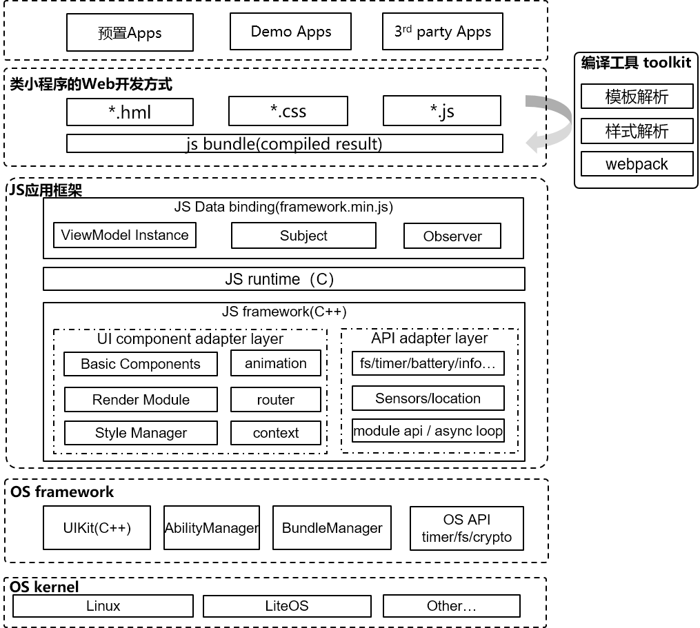

# 编译工具Toolkit



编译工具toolkit中包含了模板解析，样式解析，`webpack`

## 模板解析

类似`Vue`中的模板解析将`hml`文件解析成`AST`，也就是用`JS`中的对象来描述一个节点，一个对象代表一个节点，对象中的属性用来保存节点所需的各种数据

`Vue`例子：

```html
<div>
  <p>{{name}}</p>
</div>
```

解析后的`AST`

```javascript
{
  tag: "div"
  type: 1,
  staticRoot: false,
  static: false,
  plain: true,
  parent: undefined,
  attrsList: [],
  attrsMap: {},
  children: [
    {
      tag: "p"
      type: 1,
      staticRoot: false,
      static: false,
      plain: true,
      parent: {tag: "div", ...},
      attrsList: [],
      attrsMap: {},
      children: [{
        type: 2,
        text: "{{name}}",
        static: false,
        expression: "_s(name)"
      }]
    }
  ]
}
```


## 样式解析

使用外部样式的时候，我们要配合类型或者`ID`名来进行选择哪个标签要进行什么样的样式设置；我们也可以在命名类名的时候就带上`style`，从而在`css`的`js`文件里有条理有结构的进行样式设置.

## `Webpack`

其中`webpack`最主要的目的就是将所有小文件（其中包含模板解析后的`js`文件，样式解析后的`js`文件，应用`js`源码

）打包成一个或多个大文件,再将这个文件编译进系统中运行时通过`JS`引擎进行解释,解释后的产物交给以下组件去执行

- `图形渲染层` ：`/foundation/graphic/ui`
- `模板样式`：`app_style_manager.cpp`


## 参考资料

1. [Vue.js 模板解析器原理]([Vue.js 模板解析器原理_weixin_33963594的博客-CSDN博客](https://blog.csdn.net/weixin_33963594/article/details/91422116?utm_medium=distribute.pc_relevant.none-task-blog-2~default~BlogCommendFromBaidu~default-7.control&dist_request_id=1619573848868_85120&depth_1-utm_source=distribute.pc_relevant.none-task-blog-2~default~BlogCommendFromBaidu~default-7.control))
2. [超详细的Vue渲染原理讲解]([超详细的Vue渲染原理讲解_夕山雨的博客-CSDN博客_vue渲染原理](https://blog.csdn.net/qq_41694291/article/details/108435096?utm_medium=distribute.pc_relevant.none-task-blog-2~default~BlogCommendFromMachineLearnPai2~default-1.control&dist_request_id=1619574776661_72056&depth_1-utm_source=distribute.pc_relevant.none-task-blog-2~default~BlogCommendFromMachineLearnPai2~default-1.control))
3. [css样式详解_zhongqiu911的博客-CSDN博客](https://blog.csdn.net/zhongqiu911/article/details/110079465)
4. [24 个实例入门并掌握「Webpack4」](https://juejin.cn/post/6844903817322954759)
5. [webpack：从入门到真实项目配置](https://juejin.cn/post/6844903495959576583)
6. [浅析鸿蒙 JavaScript GUI 技术栈]([浅析鸿蒙 JavaScript GUI 技术栈 (juejin.cn)](https://juejin.cn/post/6872154561574862855))

